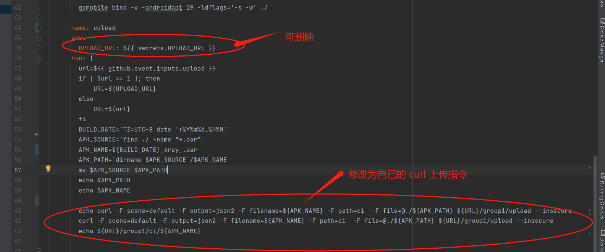

# AndroidLibXrayLite Action

[AndroidLibXrayLite](https://github.com/2dust/AndroidLibXrayLite)

增加action 生成 aar 并上传

# 使用说明
1.主要修改上传.逻辑.我这里是自己通过curl上传到自己的文件服务器,自己使用时,修改这部分代码即可

.github/workflows/build.yml

修改  **  - name: upload **  这部分即可, 拿到 $APK_PATH 后自己做处理.
